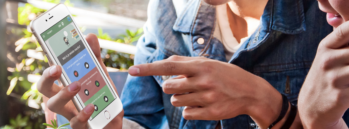
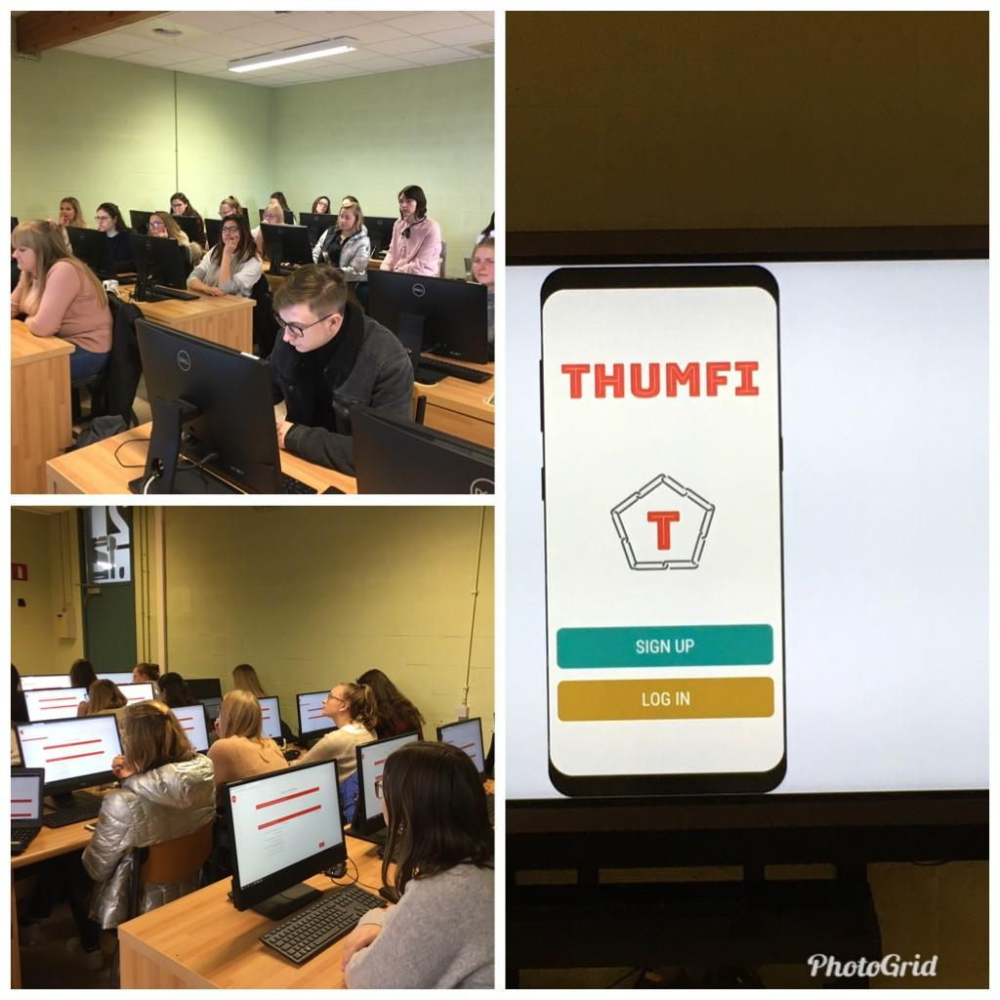
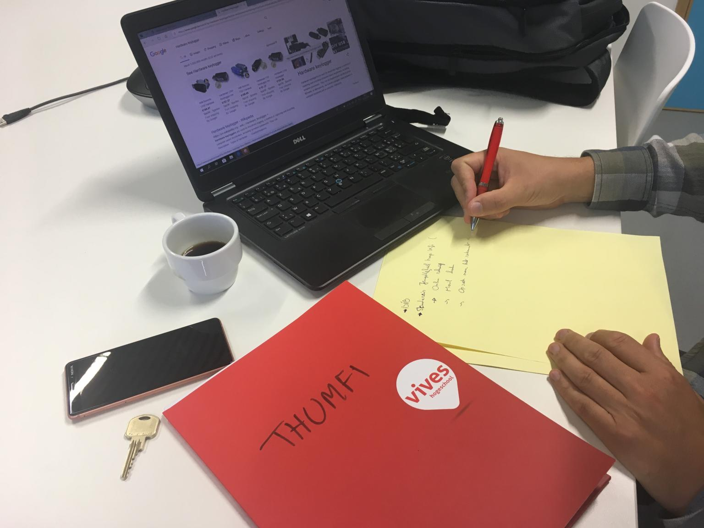
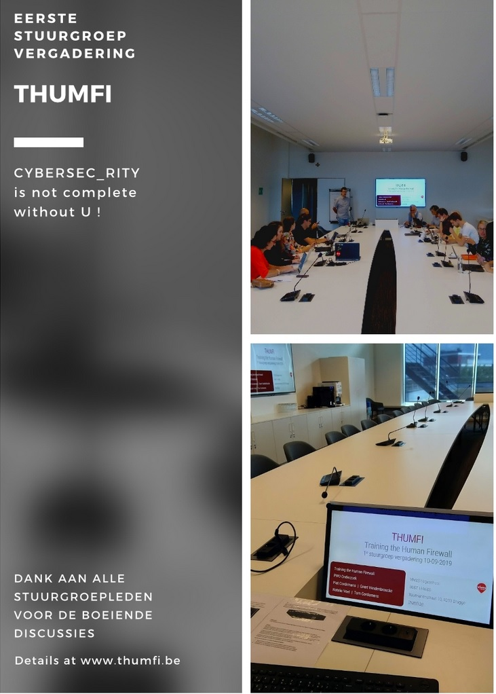

# THUMFI blog

## Computerveiligheidsdag

### 30/11/2020

Ondertussen zitten we alweer een maand volledig thuis in de ‘tweede golf’ van online werken, les volgen, shoppen enz. …  Nu we weer uren achter de laptop of smartphone doorbrengen, is het zeker nodig alert te blijven.

Jammer genoeg zitten ook nu de cybercriminelen niet stil. Vooral in momenten van stress of onoplettendheid slagen zij erin informatie los te krijgen van hun slachtoffers.

Enkele tips om veilig online te gaan:

* Geef nooit persoonlijke informatie of gegevens over je bankkaart of bankrekening als iemand erom vraagt via e-mail, Whatsapp, sms … whatever!
* Zorg dat je besturingssysteem en software up-to-date zijn
* Gebruik een verschillend wachtwoord voor elke account.
* Maak regelmatig een back-up van je bestanden.
* En vooral: gebruik je gezond verstand: als het te mooi is om waar te zijn, is het meestal niet waar!

Studenten Office Management van Vives Kortrijk én Brugge hebben een ‘instaptoets’ afgelegd over Cybersecurity. Via twee verschillende paden leren ze bij over het topic. 

In Kortrijk kregen ze les op de ‘klassieke manier’. Docent Tom Cordemans bracht er een interessant lezing met voorbeelden uit de praktijk. 

De studenten van Vives Brugge experimenteren met gamification: zij krijgen opdrachten en challenges in verband met Cybersecurity via de Thumfi-app. 

Benieuwd wie het best zal scoren bij de eindmeting eind december ….

## Corona

### 12/05/2020

Wie had twee maand geleden kunnen voorspellen dat we met z’n allen zouden overgeschakeld zijn op ‘digitaal’ leven? Digitaal les volgen, stage lopen via telewerken en straks online examen afleggen. Online workouts voor thuis, waarbij videoconferencing tools en video’s worden ingezet. Ook het aantal deelnemers aan e-sports en online gamen, kent een hoge vlucht.  Nieuwe woorden ontstaan. Virtuele ontmoetingen met je vrienden, noemt men voortaan skyperitieven.

In de bedrijven worden enorme inspanningen geleverd werknemers te beschermen en klanten te blijven bedienen tijdens de Corona-crisis. Ook hier nemen digitale oplossingen een hoge vlucht.

Jammer genoeg wordt door deze ‘digitale tsunami’ ook de blootstelling aan cyberdreigingen groter. Nu wij op grote schaal online werken en les volgen, zien ook cybercriminelen meer mogelijkheden om misbruik te maken van de minste onoplettendheid.  Gelukkig kunnen we veel informatie vinden op het internet om onze “digital awareness” aan te scherpen. De website van het centre for cybersecurity Belgium [Safeonweb.be](https://safeonweb.be/) is in dit verband zeker een aanrader. 

Ondertussen krijgt de Thumfi-app stilaan vorm. Bedoeling is om vanaf september studenten een training te geven om hun kennis rond cybersecurity en vooral hun ‘oplettendheid’ blijvend te verhogen. 

## Een eerste indruk van het doelpubliek

### 15/01/2020

Kort voor de vakantie werden de mockups voorgelegd aan onze studenten Office Management van Vives . Hun feedback is goud waard om de *dropout* tijdens het leerproces aan de hand van de app zo laag mogelijk te houden. 
We vroegen hen zeer kritisch te zijn en dat hebben we geweten ! 😊
De meesten zijn op de hoogte van de gevaren, velen zijn al in contact gekomen met phishing of andere cybercriminaliteit en willen zich *wapenen* tegen cyberaanvallen. Training the human firewall.
We leggen onze bevindingen voor aan onze stuurgroep op 10 februari. Daarna kunnen we de Thumfi App beginnen programmeren.

## Ontwikkeling van de mockups, work in progress

### 15/11/2019

Momenteel zijn we bezig met het uitwerken van realistische scenario’s met gamificatie-elementen om te gebruiken in een app. Voor een vijftal scenario’s wordt een mockup gemaakt. Deze zullen in de loop van de maand december worden voorgelegd aan studenten eerste, tweede en derde jaar Office Management van Vives Brugge en Kortrijk.  Bedoeling is om te weten te komen of de studenten deze manier van werken *aantrekkelijk* genoeg vinden. Dit is belangrijk om te verhinderen dat de gebruikers van de app  vroegtijdig afhaken. Zowel de inhoud van de scenario’s als de *look and feel* van de app worden bevraagd voor een aantal modelscenario’s. 

Het gamification effect wordt in de app ingebracht met een aantal technieken. Zo denken we eraan om te werken met teams die een zo hoog mogelijke cybersecurity score proberen te behalen. Teams kunnen ook elkaar binnen de app uitdagen met eigen scenario’s. 

In de enquête wordt voor elk scenario nagegaan of:

1. het aangeboden scenario duidelijk genoeg is
2. het scenario herkenbaar is
3. het op een aantrekkelijke manier aangebracht wordt
4. studenten eraan denken deze scenario’s te delen via hun social network. 

Daarna kunnen we de scenario’s bijsturen en overgaan tot het daadwerkelijk maken van de app.

## Scenario's schrijven gebaseerd op de leefwereld van onze studenten

### 14/10/2019

## Cybersecurity is the biggest threat to the world economy

### 12/09/2019

*Cybersecurity is the biggest threat to the world economy CEOs say.* 
Daarom hebben de expertisecentra Business Management en Smart Technologies van [Vives](https://www.vives.be/nl/onderzoek/project/human-firewall-cybersecurity) een project opgestart rond ‘Training the Human Firewall’, kortweg THUMFI.
Met als motto ‘Het echte probleem van cybersecurity zit tussen de bureaustoel en het toetsenbord’ ontwikkelen we een App om de young potentials bewuster te leren omgaan met communicatie in a connected world.
Bij de start van het academiejaar kwam voor het eerst de stuurgroep samen om te discussiëren rond dit project. 
We kijken uit naar een boeiende samenwerking met deze interessante partners!

